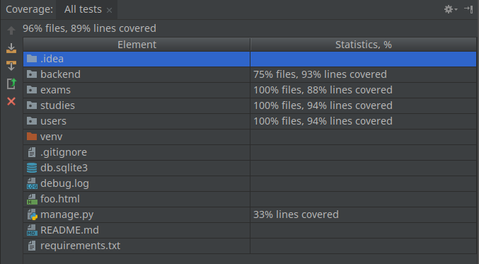

# Lea, by W.O.S

A stackoverflow-like application to discuss questions asked in exams at a certain university.
It is the practical part of a software technology / mobile applications course.

## Getting Started

Lea consists of 2 parts. An Android client application and a Rest backend written in Django.
The client depends on a running backend.


## Lea Backend
Until August 2018, a partially [browseable backend instance](https://netzweber.at:8080/api/) (everything that is read only) is available.

### Installation
To develop the backend clone the repository, change into the backend-directory and follow these steps:

Load a virtual environment
```
source <your_virtual_env>/bin/activate
```

Install all required libraries into your virtual environment
```
pip install -r requirements.txt
```

Select the used configuration for the project
```
export DJANGO_SETTINGS_MODULE=backend.settings
```

Create the database - this is SQLite by default and should require no additional configuration
```
manage.py migrate
```

(Optional)Create an admin superuser - the admin interface is available under <server_url>/admin/ 
```
manage.py createsuperuser
```

Run the development server - most of the API are browseable under <server_url>/api/
```
manage.py runserver
```

### Running the tests
To execute all available backend testcases run. Use coverage.py to generate test coverage.
```
manage.py test
```



## Lea Android client 
The android client was developed using Android Studio. To develop/run the client:

1. Download [Android Studio](https://developer.android.com/studio/)
1. Open the Lea folder as Android Studio project.
1. Run the project with the provided settings.
1. Note that the application uses the offical backend. Change this in the networking code to use your own backend implementation.

### Running the tests
To run all available tests, create a new run configuration that runs all tests
in the filder *Lea/app/src*.

## Built With
* [Android](https://developer.android.com/studio/) - Mobile client SDK
* [Retrofit](http://square.github.io/retrofit/) - Client side web service communication
* [Django](https://django-project.org) - Backend framework for administration and database development 
* [Django REST Framework](http://www.django-rest-framework.org/) - Used to create an API to use by the client

## Known problems
* The rating feature for questions did not make it into the final release, however:
    * Rating function and score output is implemented in the backend. Every question has a sum of all ratings attached.
    * UI-Elements are present in the application. Up- and downvoting buttons are present. Label for the score is in the UI.